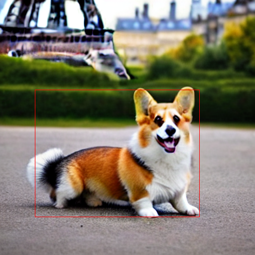

<div align="center">

# Diffusers-Interpret 🤗🧨🕵️‍♀️

  [](https://colab.research.google.com/github/JoaoLages/diffusers-interpret/blob/main/notebooks/stable_diffusion_example_colab.ipynb) 

`diffusers-interpret` is a model explainability tool built on top of [🤗 Diffusers](https://github.com/huggingface/diffusers)
</div>

## Installation

Install directly from PyPI:

    pip install --upgrade diffusers-interpret

## Usage

Let's see how we can interpret the **[new 🎨🎨🎨 Stable Diffusion](https://github.com/huggingface/diffusers#new--stable-diffusion-is-now-fully-compatible-with-diffusers)!**

**NEW**: <a href="https://colab.research.google.com/assets/colab-badge.svg)](https://colab.research.google.com/github/JoaoLages/diffusers-interpret/blob/main/notebooks/stable_diffusion_example_colab.ipynb"></a>

```python
# make sure you're logged in with `huggingface-cli login`
import torch
from contextlib import nullcontext
from diffusers import StableDiffusionPipeline
from diffusers_interpret import StableDiffusionPipelineExplainer

device = 'cuda' if torch.cuda.is_available() else 'cpu'

pipe = StableDiffusionPipeline.from_pretrained(
    "CompVis/stable-diffusion-v1-4", 
    use_auth_token=True,
    
    # FP16 is not working for 'cpu'
    revision='fp16' if device != 'cpu' else None,
    torch_dtype=torch.float16 if device != 'cpu' else None
).to(device)

# pass pipeline to the explainer class
explainer = StableDiffusionPipelineExplainer(pipe)

# generate an image with `explainer`
prompt = "A cute corgi with the Eiffel Tower in the background"
generator = torch.Generator(device).manual_seed(2022)
with torch.autocast('cuda') if device == 'cuda' else nullcontext():
    output = explainer(
        prompt, 
        num_inference_steps=15,
        generator=generator
    )
```

To see the final generated image:
```python
output.image
```


You can also check all the images that the diffusion process generated at the end of each step.


To analyse how a token in the input `prompt` influenced the generation, you can study the token attribution scores:
```python
>>> output.token_attributions # (token, attribution)
[('a', 1063.0526),
 ('cute', 415.62888),
 ('corgi', 6430.694),
 ('with', 1874.0208),
 ('the', 1223.2847),
 ('eiffel', 4756.4556),
 ('tower', 4490.699),
 ('in', 2463.1294),
 ('the', 655.4624),
 ('background', 3997.9395)]
```

Or their computed normalized version, in percentage:
```python
>>> output.normalized_token_attributions # (token, attribution_percentage)
[('a', 3.884),
 ('cute', 1.519),
 ('corgi', 23.495),
 ('with', 6.847),
 ('the', 4.469),
 ('eiffel', 17.378),
 ('tower', 16.407),
 ('in', 8.999),
 ('the', 2.395),
 ('background', 14.607)]
```

`diffusers-interpret` also computes these token attributions for generating a particular part of the image. 

To do that, call `explainer` with a particular 2D bounding box defined in `explanation_2d_bounding_box`:

```python
generator = torch.Generator(device).manual_seed(2022) # re-use generator
with torch.autocast('cuda') if device == 'cuda' else nullcontext():
    output = explainer(
        prompt, 
        num_inference_steps=15, 
        generator=generator,
        explanation_2d_bounding_box=((70, 180), (400, 435)), # (upper left corner, bottom right corner)
    )
output.image
```


The generated image now has a <span style="color:red"> **red bounding box** </span> to indicate the region of the image that is being explained.

The token attributions are now computed only for the area specified in the image.

```python
>>> output.normalized_token_attributions # (token, attribution_percentage)
[('a', 1.891),
 ('cute', 1.344),
 ('corgi', 23.115),
 ('with', 11.995),
 ('the', 7.981),
 ('eiffel', 5.162),
 ('tower', 11.603),
 ('in', 11.99),
 ('the', 1.87),
 ('background', 23.05)]
```

Check other functionalities and more implementation examples in [here](https://github.com/JoaoLages/diffusers-interpret/blob/main/notebooks/).

## Future Development
- [x] ~~Add interactive display of all the images that were generated in the diffusion process~~
- [ ] Add explainer for StableDiffusionImg2ImgPipeline
- [ ] Add explainer for StableDiffusionInpaintPipeline
- [ ] Add interactive bounding-box and token attributions visualization
- [ ] Add unit tests
- [ ] Add example for `diffusers_interpret.LDMTextToImagePipelineExplainer`
- [ ] Do not require another generation every time the `explanation_2d_bounding_box` argument is changed
- [ ] Add more explainability methods

## Contributing
Feel free to open an [Issue](https://github.com/JoaoLages/diffusers-interpret/issues) or create a [Pull Request](https://github.com/JoaoLages/diffusers-interpret/pulls) and let's get started 🚀

## Credits

A special thanks to [@andrewizbatista](https://github.com/andrewizbatista) for creating a great [image slider](https://github.com/JoaoLages/diffusers-interpret/pull/1) to show all the generated images during diffusion! 💪 
