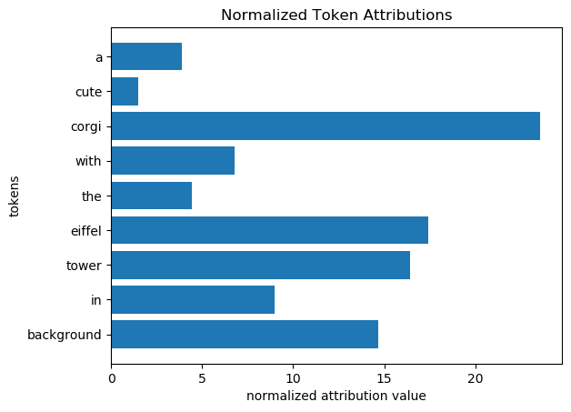

<div align="center">

# Diffusers-Interpret 🤗🧨🕵️‍♀️

  

`diffusers-interpret` is a model explainability tool built on top of [🤗 Diffusers](https://github.com/huggingface/diffusers)
</div>

## Installation

Install directly from PyPI:

    pip install --upgrade diffusers-interpret

## Usage

Let's see how we can interpret the **[new 🎨🎨🎨 Stable Diffusion](https://github.com/huggingface/diffusers#new--stable-diffusion-is-now-fully-compatible-with-diffusers)!**

1. [Explanations for StableDiffusionPipeline](#explanations-for-stablediffusionpipeline)
2. [Explanations for StableDiffusionImg2ImgPipeline](#explanations-for-stablediffusionimg2imgpipeline)
3. [Explanations for StableDiffusionInpaintPipeline](#explanations-for-stablediffusioninpaintpipeline)

### Explanations for StableDiffusionPipeline
[](https://colab.research.google.com/github/JoaoLages/diffusers-interpret/blob/main/notebooks/stable_diffusion_example_colab.ipynb)

```python
import torch
from contextlib import nullcontext
from diffusers import StableDiffusionPipeline
from diffusers_interpret import StableDiffusionPipelineExplainer

device = 'cuda' if torch.cuda.is_available() else 'cpu'

pipe = StableDiffusionPipeline.from_pretrained(
    "CompVis/stable-diffusion-v1-4", 
    use_auth_token=True,
    
    # FP16 is not working for 'cpu'
    revision='fp16' if device != 'cpu' else None,
    torch_dtype=torch.float16 if device != 'cpu' else None
).to(device)

# optional: reduce memory requirement with a speed trade off 
pipe.enable_attention_slicing()

# pass pipeline to the explainer class
explainer = StableDiffusionPipelineExplainer(pipe)

# generate an image with `explainer`
prompt = "A cute corgi with the Eiffel Tower in the background"
with torch.autocast('cuda') if device == 'cuda' else nullcontext():
    output = explainer(
        prompt, 
        num_inference_steps=15
    )
```

If you are having GPU memory problems, try reducing `n_last_diffusion_steps_to_consider_for_attributions`, `height`, `width` and/or `num_inference_steps`.
```
output = explainer(
    prompt, 
    num_inference_steps=15,
    height=448,
    width=448,
    n_last_diffusion_steps_to_consider_for_attributions=5
)
```

You can completely deactivate token/pixel attributions computation by passing `n_last_diffusion_steps_to_consider_for_attributions=0`.  

Gradient checkpointing also reduces GPU usage, but makes computations a bit slower:
```
explainer = StableDiffusionPipelineExplainer(pipe, gradient_checkpointing=True)
```

To see the final generated image:
```python
output.image
```


You can also check all the images that the diffusion process generated at the end of each step:
```python
output.all_images_during_generation.show()
```


To analyse how a token in the input `prompt` influenced the generation, you can study the token attribution scores:
```python
>>> output.token_attributions # (token, attribution)
[('a', 1063.0526),
 ('cute', 415.62888),
 ('corgi', 6430.694),
 ('with', 1874.0208),
 ('the', 1223.2847),
 ('eiffel', 4756.4556),
 ('tower', 4490.699),
 ('in', 2463.1294),
 ('the', 655.4624),
 ('background', 3997.9395)]
```

Or their computed normalized version, in percentage:
```python
>>> output.token_attributions.normalized # (token, attribution_percentage)
[('a', 3.884),
 ('cute', 1.519),
 ('corgi', 23.495),
 ('with', 6.847),
 ('the', 4.469),
 ('eiffel', 17.378),
 ('tower', 16.407),
 ('in', 8.999),
 ('the', 2.395),
 ('background', 14.607)]
```

You can also view token attributions as a plot!
```python
output.token_attributions.plot(normalize=True)
```


`diffusers-interpret` also computes these token/pixel attributions for generating a particular part of the image. 

To do that, call `explainer` with a particular 2D bounding box defined in `explanation_2d_bounding_box`:

```python
with torch.autocast('cuda') if device == 'cuda' else nullcontext():
    output = explainer(
        prompt, 
        num_inference_steps=15, 
        explanation_2d_bounding_box=((70, 180), (400, 435)), # (upper left corner, bottom right corner)
    )
output.image
```


The generated image now has a <span style="color:red"> **red bounding box** </span> to indicate the region of the image that is being explained.

The attributions are now computed only for the area specified in the image.

```python
>>> output.token_attributions.normalized # (token, attribution_percentage)
[('a', 1.891),
 ('cute', 1.344),
 ('corgi', 23.115),
 ('with', 11.995),
 ('the', 7.981),
 ('eiffel', 5.162),
 ('tower', 11.603),
 ('in', 11.99),
 ('the', 1.87),
 ('background', 23.05)]
```

### Explanations for StableDiffusionImg2ImgPipeline
[](https://colab.research.google.com/github/JoaoLages/diffusers-interpret/blob/main/notebooks/stable_diffusion_img2img_example.ipynb)

```python
import torch
import requests
from PIL import Image
from io import BytesIO
from diffusers import StableDiffusionImg2ImgPipeline
from diffusers_interpret import StableDiffusionImg2ImgPipelineExplainer


pipe = StableDiffusionImg2ImgPipeline.from_pretrained(
    "CompVis/stable-diffusion-v1-4", 
    use_auth_token=True,
).to('cuda')

explainer = StableDiffusionImg2ImgPipelineExplainer(pipe)

prompt = "A fantasy landscape, trending on artstation"

# let's download an initial image
url = "https://raw.githubusercontent.com/CompVis/stable-diffusion/main/assets/stable-samples/img2img/sketch-mountains-input.jpg"

response = requests.get(url)
init_image = Image.open(BytesIO(response.content)).convert("RGB")
init_image = init_image.resize((448, 448))

with torch.autocast('cuda'):
    output = explainer(
        prompt=prompt, init_image=init_image, strength=0.75
    )
```

`output` will have all the properties that were presented for [StableDiffusionPipeline](#explanations-for-stablediffusionpipeline).
For example, to see the gif version of all the images during generation:
```python
output.all_images_during_generation.gif()
```


Additionally, it is also possible to visualize pixel attributions of the input image as a saliency map:
```python
output.input_saliency_map.show()
```


or access their values directly:
```python
>>> output.pixel_attributions
array([[ 1.2714844 ,  4.15625   ,  7.8203125 , ...,  2.7753906 ,
         2.1308594 ,  0.66552734],
       [ 5.5078125 , 11.1953125 ,  4.8125    , ...,  5.6367188 ,
         6.8828125 ,  3.0136719 ],
       ...,
       [ 0.21386719,  1.8867188 ,  2.2109375 , ...,  3.0859375 ,
         2.7421875 ,  0.7871094 ],
       [ 0.85791016,  0.6694336 ,  1.71875   , ...,  3.8496094 ,
         1.4589844 ,  0.5727539 ]], dtype=float32)
```
or the normalized version:
```python
>>> output.pixel_attributions.normalized 
array([[7.16054201e-05, 2.34065039e-04, 4.40411852e-04, ...,
        1.56300011e-04, 1.20002325e-04, 3.74801020e-05],
       [3.10180156e-04, 6.30479713e-04, 2.71022669e-04, ...,
        3.17439699e-04, 3.87615233e-04, 1.69719147e-04],
       ...,
       [1.20442292e-05, 1.06253210e-04, 1.24512037e-04, ...,
        1.73788882e-04, 1.54430119e-04, 4.43271674e-05],
       [4.83144104e-05, 3.77000870e-05, 9.67938031e-05, ...,
        2.16796136e-04, 8.21647482e-05, 3.22554370e-05]], dtype=float32)
```

**Note:** Passing `explanation_2d_bounding_box` to the `explainer` will also change these values to explain a specific part of the **output** image. 
<ins>The attributions are always calculated for the model's input (image and text) with respect to the output image.</ins>

### Explanations for StableDiffusionInpaintPipeline
[](https://colab.research.google.com/github/JoaoLages/diffusers-interpret/blob/main/notebooks/stable_diffusion_inpaint_example.ipynb)

Same as [StableDiffusionImg2ImgPipeline](#explanations-for-stablediffusionimg2imgpipeline), but now we also pass a `mask_image` argument to `explainer`.

```python
import torch
import requests
from PIL import Image
from io import BytesIO
from diffusers import StableDiffusionInpaintPipeline
from diffusers_interpret import StableDiffusionInpaintPipelineExplainer


def download_image(url):
    response = requests.get(url)
    return Image.open(BytesIO(response.content)).convert("RGB")


pipe = StableDiffusionInpaintPipeline.from_pretrained(
    "CompVis/stable-diffusion-v1-4", 
    use_auth_token=True,
).to('cuda')

explainer = StableDiffusionInpaintPipelineExplainer(pipe)

prompt = "a cat sitting on a bench"

img_url = "https://raw.githubusercontent.com/CompVis/latent-diffusion/main/data/inpainting_examples/overture-creations-5sI6fQgYIuo.png"
mask_url = "https://raw.githubusercontent.com/CompVis/latent-diffusion/main/data/inpainting_examples/overture-creations-5sI6fQgYIuo_mask.png"

init_image = download_image(img_url).resize((448, 448))
mask_image = download_image(mask_url).resize((448, 448))

with torch.autocast('cuda'):
    output = explainer(
        prompt=prompt, init_image=init_image, mask_image=mask_image, strength=0.75
    )
```

`output` will have all the properties that were presented for [StableDiffusionImg2ImgPipeline](#explanations-for-stablediffusionimg2imgpipeline) and [StableDiffusionPipeline](#explanations-for-stablediffusionpipeline).  
For example, to see the gif version of all the images during generation:
```python
output.all_images_during_generation.gif()
```


The only difference in `output` now, is that we can now see the masked part of the image:
```python
output.input_saliency_map.show()
```


Check other functionalities and more implementation examples in [here](https://github.com/JoaoLages/diffusers-interpret/blob/main/notebooks/).

## Future Development
- [x] ~~Add interactive display of all the images that were generated in the diffusion process~~
- [x] ~~Add explainer for StableDiffusionImg2ImgPipeline~~
- [x] ~~Add explainer for StableDiffusionInpaintPipeline~~
- [ ] Add attentions visualization 
- [ ] Add unit tests
- [ ] Website for documentation
- [ ] Do not require another generation every time the `explanation_2d_bounding_box` argument is changed
- [ ] Add interactive bounding-box and token attributions visualization
- [ ] Add more explainability methods

## Contributing
Feel free to open an [Issue](https://github.com/JoaoLages/diffusers-interpret/issues) or create a [Pull Request](https://github.com/JoaoLages/diffusers-interpret/pulls) and let's get started 🚀

## Credits

A special thanks to:
- [@andrewizbatista](https://github.com/andrewizbatista) for creating a great [image slider](https://github.com/JoaoLages/diffusers-interpret/pull/1) to show all the generated images during diffusion! 💪 
- [@TomPham97](https://github.com/TomPham97) for README improvements and the [GIF visualization](https://github.com/JoaoLages/diffusers-interpret/pull/9) 😁